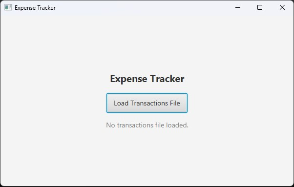
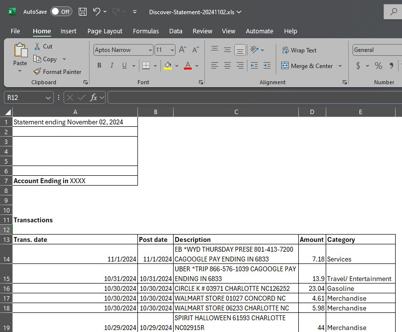
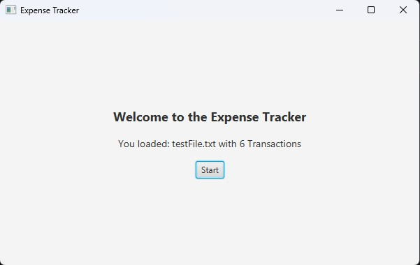
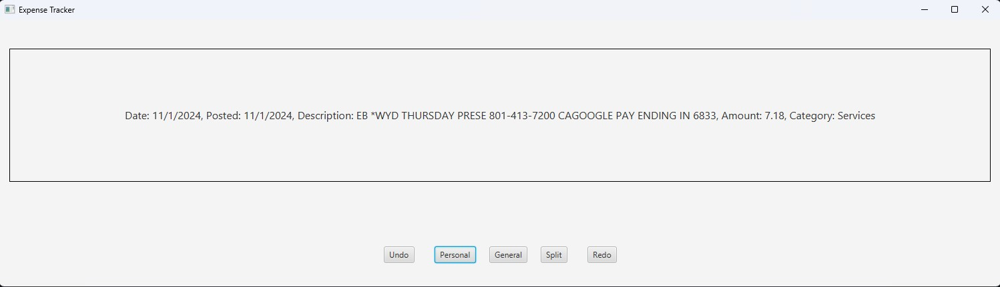
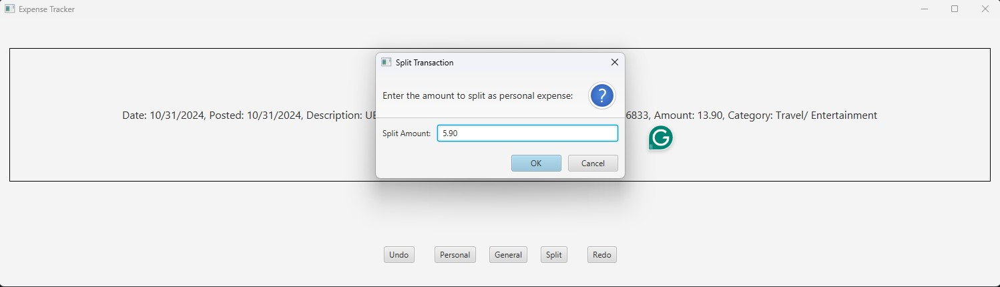
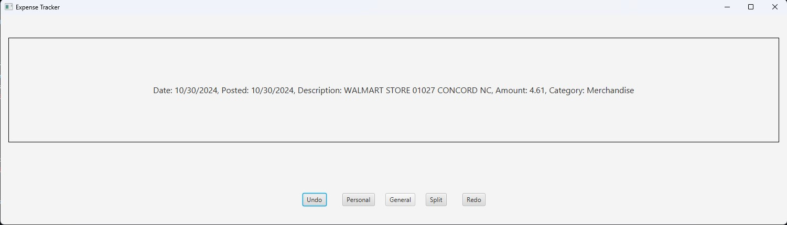
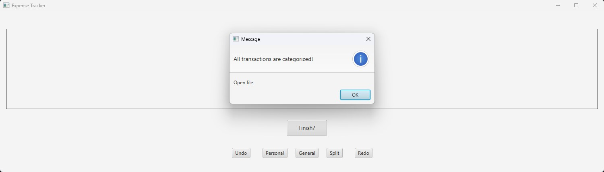
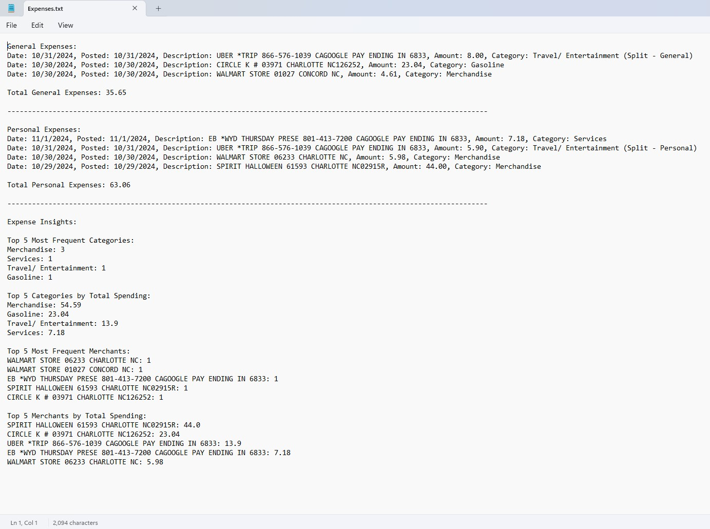

# Expense Tracker Application

## Overview
Managing personal finances can be challenging, particularly for individuals like students and young professionals who need to track both personal and general expenses and income from different sources. The Expense Tracker application aims to simplify this process by providing a user-friendly platform to categorize, track, and analyze spending habits. It features advanced tools such as undo/redo for correcting mistakes and frequency analysis for gaining deeper insights into financial behavior.

---

## Features
- **Expense Categorization**: Track personal and general expenses effortlessly.
- **Undo/Redo Functionality**: Correct mistakes by reverting or reinstating actions.
- **Frequency Analysis**: Understand spending trends by analyzing transaction patterns.
- **User-Friendly Interface**: Simple and intuitive design for hassle-free use.

---

## Target Users
- Students managing personal and family-supported expenses.
- Young professionals optimizing their budgets.
- Anyone seeking a straightforward way to track and analyze spending habits.

---

## Installation
1. Download the zip folder [here](https://drive.google.com/file/d/1ZHSwQFcjnscxueEL4iVXnTcn26ysxiTt/view?usp=drive_link).
2. Extract files.
3. Open the bin folder.
4. Search for expenseTracker.bat.
5. Run file.

---

## How to Use

### 1. **Launch the Application**
Open the application on your device.

### 2. **Load transaction .txt file**
- Directly copy transactions from your bank statement .csv (Tested with Discover Statement).
- Paste it in a .txt file and upload it.
  

### 3. **Categorize your transactions**
- Categorize your transaction as personal, general or split them.
  

### 4. **Undo/Redo Actions**
- Click the **Undo** button to revert the last action.
- Use **Redo** to reinstate an undone action.
  

### 5. **View insights and categorized expenses**
- Click Finish? when you are done. It will generate an Expenses.txt file in the bin folder.
  

